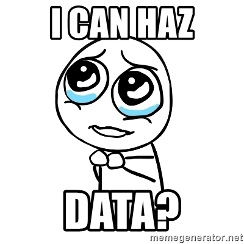
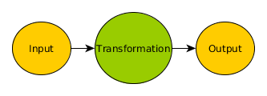
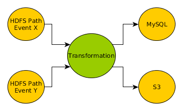
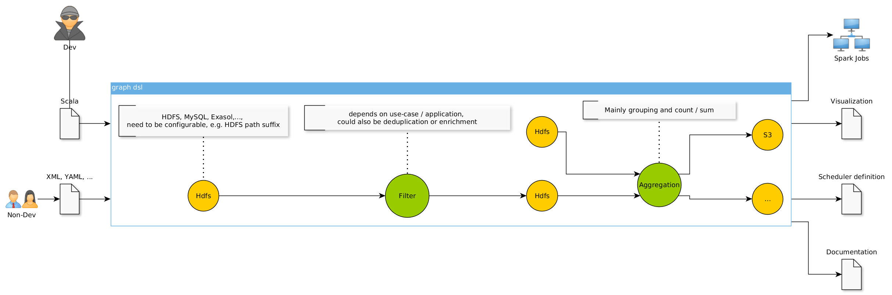

## Graph DSLs (not-only) for Spark

:sparkles:

___

# About Us
___

## Andreas Drobisch 

*Data Engineer*

I like Scala and (free) food

:pizza:
___


- AdTech, 1 BLN devices reachable, creating more than 2 BLN events per day
- 300+ people
- Offices in Berlin, Israel, Bejing, New York, London, San Francisco
___

## Ad Tech


___

We like :scala:


___

**We are hiring** (see the print-outs) 

if interested, talk to us :speech_balloon:
___

**Graph** DSLs (not-only) for Spark
___

## Graph definition

```math
G = (V, E) \\

V = \mathbf{Vertices} \\

E = \mathbf{Edges}
```
___

$$E$$ 

defines the kind of graph

$$E \subseteq V \times  V $$

defines a (un)-directed graph

___
### Examples
#### Clothing dependencies for developers


___

#### German Cities


___

## Other Examples

 - family tree
 - dependency tree
 - JIRA issue dependencies / relations
 - state machine transitions 
___

Graph **DSL**s (not-only) for Spark
___

## Domain Specific Language

>  "is a computer **language** that's targeted to a **particular kind** of problem, **rather** than a **general purpose** language that's aimed at any kind of software problem" 

Martin Fowler
___

### Commonly Known DSLs

SQL, CSS, RegEx

---

## DSL flavors

- **internal / embedded**: live inside a *host* language, allow to use host language to express domain statements 
- **external / standalone**: own syntax, need their own parser
- can be mixed, resulting in tradeoffs in expressiveness
___

## Running DSL programs

(embedded) **interpreter**

code **generation**
___

**Functional** interpreters / the **Free** monad can be considered **embedded** DSLs.

Great talk *"Functional interpreters and you"* from *Dave Gurnell* on that topic during Scala Days 2018 (Berlin). 
___ 

Graph DSLs (not-only) for **Spark**
___

## Spark

* open-source (in-memory) cluster-computing framework
* a big hammer in the data toolbox with SQL / Streaming / ML packages
* created to overcome Hadoop Map-Reduce issues
___

mainly used for counting words :trollface:

```scala
val textFile = sc.textFile("hdfs://...")
val counts = textFile.flatMap(line => line.split(" "))
                 .map(word => (word, 1))
                 .reduceByKey(_ + _)
counts.saveAsTextFile("hdfs://...")
```
___

## Collection like interface

Using the Spark **DataFrame** API (examples from the Spark doc):

```scala
val df: DataFrame = spark.read.json("examples/src/main/resources/people.json")

// Displays the content of the DataFrame to stdout
df.show()
// +----+-------+
// | age|   name|
// +----+-------+
// |null|Michael|
// |  30|   Andy|
// |  19| Justin|
// +----+-------+

```
___

### Select

```scala
// Select everybody, but increment the age by 1
df.select($"name", $"age" + 1).show()
// +-------+---------+
// |   name|(age + 1)|
// +-------+---------+
// |Michael|     null|
// |   Andy|       31|
// | Justin|       20|
// +-------+---------+

```
___

### Filter
```scala
// Select people older than 21
df.filter($"age" > 21).show()
// +---+----+
// |age|name|
// +---+----+
// | 30|Andy|
// +---+----+
```
___

### Group

```scala
// Count people by age
df.groupBy("age").count().show()
// +----+-----+
// | age|count|
// +----+-----+
// |  19|    1|
// |null|    1|
// |  30|    1|
// +----+-----+
```
___

## Domain Overview 
___

## Product



___

Needs to **analyse KPIs** for a complex product (15+ event types). 

Lots of **data** (think TBs, not GB), needs to be **aggregated**. 
___

## Data Team

Needs to write code to get that data continously in a *scala*ble way.


`https://www.xkcd.com/303`
___

## Basic Pipeline


___

## 1. Iteration - Just Code

```scala
data.select(groupCols: _*)
    .withColumn("count", lit(1))
    .groupBy(groupCols: _*)
    .agg("count" -> "sum")
    .withColumnRenamed("sum(count)", "count")
```

* Write Scala Spark code for all the aggregations
* Build some scripts and click around for scheduling jobs
___

## Problems
___

Lacked clear **separation** between **configuration** / **implementation** of **aggregations** (hardcoded settings for output formats, mix-ups between outputs etc.)
___

Lots of **manual configuration** (mainly for Oozie, our scheduler at that time) and **mismatches** between stages
___

Understanding an aggregation needed *inside knowledge* of both the **aggregation code** and the involved **configuration** parts
___

$$\Sigma$$

creating, verifying and optimizing aggregations took a **lot of time**
___

## Goals
___

* Creating a new **aggregation** with already implemented logic should be a **configuration** task, not a coding task
* Aggregations **logic** should be **transparent**, also for outsiders / non-developers
* What can be **automated**, should be automated
* **Information** about aggregations can easily be **shared** across several components
___

## The Solution ™

> All problems in computer science can be solved by another level of **indirection**

David Wheeler
___

**So we build an abstraction...**
___

## Spark graph DSL
### Basic pattern



Hello again **IPO-Model / "EVA-Prinzip"**.
___

## Multiple IO


___


___


___

## Transformation Nodes

- Select
- Filter
- Group
- Aggregation
- ...
___

## Transformation Sequence


___

## Graph Types

```scala
trait DataNode
trait InputNode extends DataNode
trait OutputNode extends DataNode

final case class HdfsPath(pathPattern: String) extends InputNode with OutputNode

final case class DataFlow(
  source: DataNode,
  target: DataNode,
  label: Option[String]
) extends DirectedEdge[DataNode]

trait DataGraph extends Graph[DataNode, DataFlow]
```
___

## Transformation Types

```scala
trait TransformationNode extends DataNode { def name: String }

final case class Filter(
  name: String,
  conditions: Seq[Condition]
) extends TransformationNode

final case class Group(
  name: String,
  groupColumns: Seq[String],
  columnAggregations: Seq[ColumnAggregationSpec]
) extends TransformationNode

trait SparkTransformation extends DataFrameProvider => Try[DataFrame]
```
___

## Simple Data Graph

```scala
val input = HdfsPath(...)

val hdfsOutput = ImpalaOutput(HdfsPath(...))
val mysqlOutput = MySQLOutput(topic, config = dbConfig)

val filtering = Filter(s"$topic-filter", 
  Seq(Equals("ad_source", "ad_marketplace"))
)

val grouping = Group(
  s"$topic-group", 
  groupColumns = Seq("country", "ad_format")
)

val transformations = Transformations(s"$topic-transformation", Seq(filtering, grouping))
input ~> transformations

transformations ~> hdfsOutput
transformations ~> mysqlOutput
```
___

## Interpretation of the graph

**traverse** the graph

transformation **nodes** are mapped to Scala **functions**

sequences are **composed** functions
___

## Node Context

```scala
def inputs(node: DataNode, graph: DataGraph): Seq[InputNode] = graph.incoming(node).map(_.source).flatMap {
  case input: InputNode => Some(input)
  case impala: ImpalaOutput => Some(impala.data)
  case _ => None
}.toSeq

def outputs(node: DataNode, graph: DataGraph): Seq[OutputNode] = graph.outgoing(node).map(_.target).flatMap {
  case output: OutputNode => Some(output)
  case _ => None
}.toSeq
```
___

## Filter Implementation

```scala
case class FilteringTransformation(filtering: Filter) extends SparkTransformation 
...

filtering.conditions.foldLeft(df) {
    (dfAcc, condition) => dfAcc.filter(booleanColumnExpression(condition, dfAcc.columns))
}
```
___

## Group Implementation

```scala
case class GroupingTransformation(grouping: Group) extends SparkTransformation
...

grouping.columnAggregations.foldLeft(Seq(aggregationColumn as countCol)) {
    case (accAggregations, aggregation) => aggregation.aggregation match {
    case Sum =>
        accAggregations :+ sum(aggregation.column)
    case Min =>
        accAggregations :+ min(aggregation.column)
    case Max =>
        accAggregations :+ max(aggregation.column)
    case Average =>
        accAggregations :+ avg(aggregation.column)
    case CountDistinct =>
        accAggregations :+ countDistinct(aggregation.column)
    case _ => accAggregations
  }
}
```
___

## Leveraging the abstraction
___

## Scheduler

We decided to use [Airflow](https://airflow.incubator.apache.org/) which uses **directed acyclic graphs (DAGs)** to define the workflow.


___

Perfect fit for our Graph :thumbsup:


___

But you have to use `python` :cry: ...
___

## Lets generate DAGs!

```python
with DAG('some-spark', catchup=False) as dag:
    run_latest_only = LatestOnlyOperator(task_id='run-spark-shell', dag=dag)
    run = BashOperator(
        task_id='run_spark',
        bash_command=transformation_command,
        on_failure_callback = lambda context: error_notification("error in job: ".format(ts = context["ts"]), context)
    )
    run.set_upstream(run_latest_only)
    
    triggerNext1 = TriggerDagRunOperator(task_id = 'trigger_downstream1',
                          trigger_dag_id = "trigger_downstream1_dag",
                          python_callable = trigger,
                          dag=dag)
    triggerNext1.set_upstream(run)

// graph.outgoing ...

    triggerNext2 = TriggerDagRunOperator(task_id = 'trigger_downstream1',
                          trigger_dag_id = "trigger_downstream1_dag",
                          python_callable = trigger,
                          dag=dag)
    triggerNext2.set_upstream(run)
...
```
___

## Generated Diagram


___

## Operations

We can just go over graph (which is the source of truth) and execute an action:

```scala
dataGraph.nodes.find(...).foreach { node =>
  // do something awesome
}
```
___

## Change the Flow
From
 to

___


## ?
___

## Problems

- tends to get a **leaky** abstraction, how to finetune Spark operational (memory, executoros) aspects?
- completeness of the abstraction (expression problem)
- definining the graph can be **tedious** vs just using the Spark method
- **additional layer** to maintain
___

## Build your own graphs!
### Free Ideas

- graph that models firewall rules and creates the config
- graph that documents your (µ-)services and converts it to markdown
- something that you might want to edit / generate outside your code, but run as code
___

## graphs library

[https://github.com/flowtick/graphs](https://github.com/flowtick/graphs)

is a simple graph library for Scala and Scala.js, that we used to build our data graph.

---

The Spark part is not open-source 

:cry:
___

## Why? (NIH?)

- Wanted to use it in the browser (Scala.js)
- GraphML support (for loading / saving from [yed](https://www.yworks.com/yed))
- many libraries are more storage focused
- Rúnar B. taught me to rewrite libraries in :redbook:
___

## Core Types

```scala
trait Edge[E, N] {
  def value: E
  def predecessors: Set[N]
  def successors: Set[N]
}

trait Graph[N, E] {
  def nodes: Set[N]
  def edges: Set[Edge[E, N]]

  def incoming(node: N): Iterable[Edge[E, N]]
  def outgoing(node: N): Iterable[Edge[E, N]]
}

// edge typeclass
trait EdgeBuilder[N, E, B] {
  def create(from: B)
  (implicit identifiable: Identifiable[N]): Edge[E, N]
}
```
___

### Pants again


___

## Example

```scala
import com.flowtick.graphs.defaults._
import com.flowtick.graphs.defaults.directed._

val clothingDependencies = DefaultGraph.create(Seq(
    n("Underpants") -> n("Pants"),
    n("Pants") -> n("Coat"),
    n("Pullover") -> n("Coat"),
    n("Undershirt") -> n("Pullover"),
    n("Pants") -> n("Shoes"),
    n("Socks") -> n("Shoes")))
```
___

## Supported Algorithms

- Dijkstra (finds a shortest path in weighted graph)
- Breadth-First Search (search for node level by level)
- Depth-First Search (search for node path by path)
- Topological Sorting (finds an ordering in a directed graph)
___

```scala
import com.flowtick.graphs.algorithm._

println(clothingDependencies.topologicalSort)
//
List(
    DefaultNode(Socks), 
    DefaultNode(Undershirt), 
    DefaultNode(Pullover),
    DefaultNode(Underpants),
    DefaultNode(Pants), 
    DefaultNode(Shoes), 
    DefaultNode(Coat)
)
```
___

## Inheritance vs type classes


___
```scala
implicit def edgeBuilder[N]: EdgeBuilder[N, DefaultEdge[N], (N, N)] = new EdgeBuilder[N, DefaultEdge[N], (N, N)] {
    override def create(from: (N, N))
    (implicit identifiable: Identifiable[N]): DefaultEdge[N] = 
      DefaultEdge(from._1, Some(from._2))
}

implicit def weightedEdgeBuilder[E, N, V, B]
(implicit edgeBuilder: EdgeBuilder[N, E, B]): EdgeBuilder = ...
```
___

## cats
```scala
implicit def graphMonoid[N, E]: Monoid[Graph[N, E]] = new Monoid[Graph[N, E]] {
  override def empty: Graph[N, E] = Graph.empty()

  override def combine(x: Graph[N, E], y: Graph[N, E]): Graph[N, E] =
    Graph[N, E](x.nodes ++ y.nodes, x.edges ++ y.edges)
}
```
___

### Combined Graphs


---
## project

is still in **design exploration** phase

**contributions** welcome !
___

## tl;dr;

- Graphs are proved useful for our **data dependency** and Spark transformation definitions
- our abstraction helped to automate maintenance tasks, document our domain
- not without problems (**abstractions** deliver tradeoffs)
- you can build your own graphs using `graphs`
___


**Thanks for coming.**

:cup-with-straw:, :beer: + :pizza:! 
